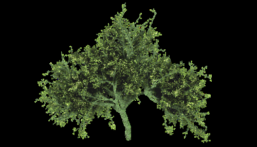

This is a small tool to bleed the border colors of an image with transparency through the pixels that
are fully transparent. It's intended to avoid filtering issues in OpenGL applications.

**Usage:**

`alpha-bleeding <input> <output>`

Both `<input>` and `<output>` should be PNG image files.

**Building:**

Just type `make` on the root directory. `libpng` and `libz` are the only required dependencies.

**Example:**

It's hard to see the effect of this tool, given that it only modifies the transparent pixels, so I
added another tool which just changes the alpha channel of every pixel to fully opaque. It can be
used the same way:

`alpha-remove <input> <output>`

Using that helper tool you can clearly see the effect of the alpha bleeding:

Original image:

Image after `alpha-bleeding` (not much to see):

Original image after `alpha-remove`:

Image after `alpha-bleeding` and `alpha-remove`:

